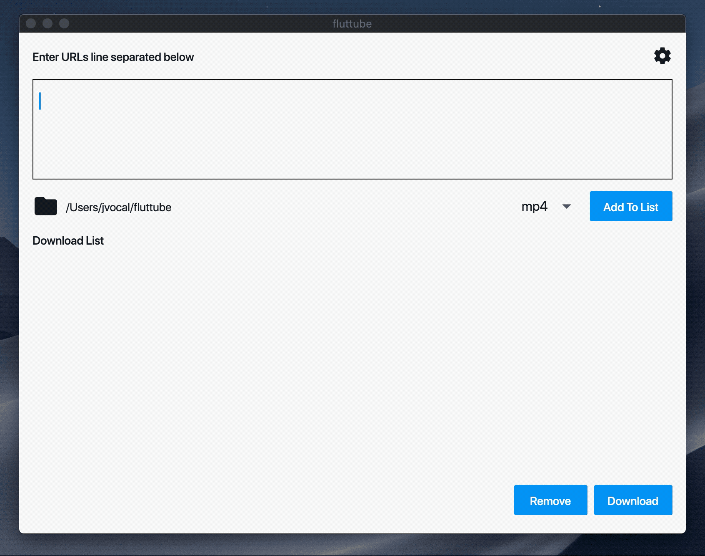

# fluttube

💽 A Flutter Desktop GUI wrapper for youtube-dl.

Inspired by other cross-platform desktop programs.

## Quick Demo

Downloading three videos in mp4.

 <p align="center"> 
    
 </p>

 ## Installing

You'll need to have `youtube-dl` first.

```
brew install youtube-dl
```

 Currently can only be build for macOS.

 ```
flutter run -d macOS
 ```

 ## Libraries

 Uses `dart.io` with `process` to be able to call the command-line.

 ## Improvements

- [ ] Add more options in the settings
- [ ] Be able to change the download file path
- [ ] Be able pause and resume downloads
- [ ] Cleaner code
- [ ] Add Windows/Linux


